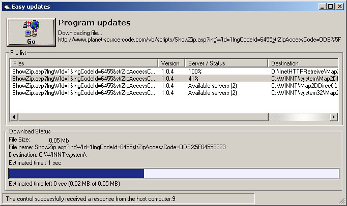



## Download files, Update you app and more \!

### Description

This application will allow you to update your application via HTTP. A plain text file contains all the files/servers/destination path for the update. You often need a third party app to update your own app since you often need to close the actual app and replace the exe. You can also modify this app to fit other needs. You will learn how to download a file from the Internet.

Thanks.
 
### More Info
 

             |
---                |---
**Submitted On**   |2002-07-08 08:30:48
**By**             |[HarveySolutions](https://github.com/Planet-Source-Code/PSCIndex/blob/master/ByAuthor/harveysolutions.md)
**Level**          |Advanced
**User Rating**    |4.2 (25 globes from 6 users)
**Compatibility**  |VB 6\.0
**Category**       |[Complete Applications](https://github.com/Planet-Source-Code/PSCIndex/blob/master/ByCategory/complete-applications__1-27.md)
**World**          |[Visual Basic](https://github.com/Planet-Source-Code/PSCIndex/blob/master/ByWorld/visual-basic.md)
**Archive File**   |[Download\_f103404782002\.zip](https://github.com/Planet-Source-Code/harveysolutions-download-files-update-you-app-and-more__1-36707/archive/master.zip)

